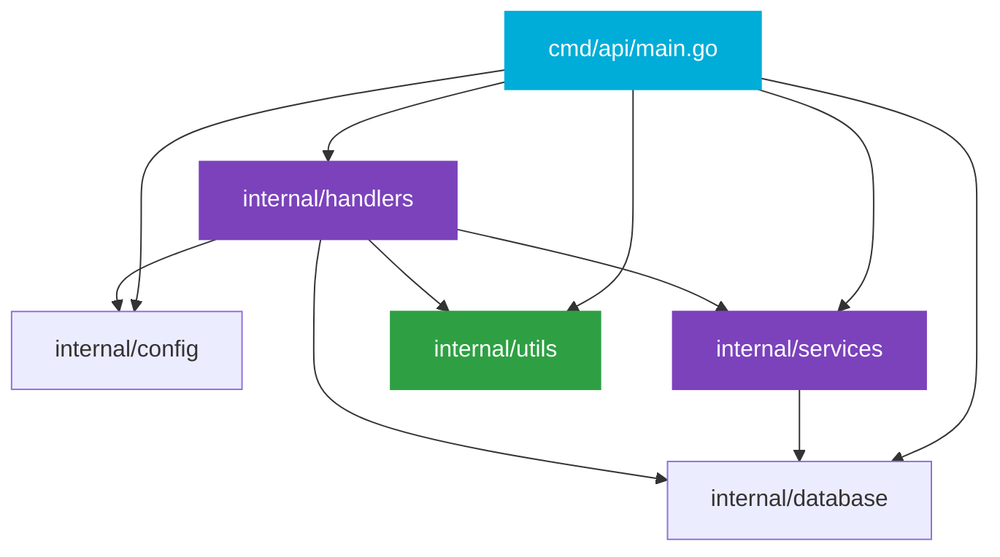

<div align="center">


# ⛰️ Strata

### The Open-Source ERP‑CRM Hybrid — Built for the Frontier

[](https://go.dev/)
[](https://www.postgresql.org/)
[](https://www.docker.com/)
[](LICENSE)
[]()

<br>

> **Strata** is a modular, AI‑native ERP‑CRM platform — a direct open‑source competitor to Odoo.  
> Built in **Go** with a clean layered architecture, it ships with **25 fully‑implemented business modules**  
> spanning CRM, Finance, Supply Chain, HR, and Platform AI.

</div>

---

## 📦 Project Structure

<details open>
<summary><b>Click to expand/collapse</b></summary>

```
cmd/
├── api/main.go          # Entry point. Wires config, database, services, and starts the server.
└── cli/
    └── publish-soc-events/main.go   # Publish mock SOC security events to Redis for testing

internal/
├── services/            # BUSINESS LAYER — service + repository per domain
│   ├── services_auth.go        # AuthService: JWT, bcrypt
│   ├── services_users.go       # UserService: users, organization memberships
│   ├── services_orgs.go        # OrgService: organizations, invitations, API keys
│   ├── services_rbac.go        # RBACService: roles, permissions
│   ├── services_billing.go     # BillingService: subscriptions
│   ├── services_crm.go         # CRMService: leads, deals, quotes, AI analysis
│   ├── services_accounting.go  # AccountingService: journal entries, OCR, expenses
│   ├── services_supplychain.go # SupplyChainService: fleet, telematics, inventory, routes
│   ├── services_hr.go          # HRService: attendance, resume parsing, knowledge search
│   ├── services_platform.go    # PlatformService: AI copilot, workflows, security anomalies
│   ├── services_super_admin.go # SuperAdminService: observability, SOC, maintenance, CI health
│   └── services_mailer.go      # Mailer: transactional email (stub)
│
├── handlers/            # HTTP LAYER — handlers, routes, App wiring
│   ├── handlers_server.go             # App struct, New(), Serve() — all dependency injection
│   ├── handlers_routes.go             # Route registration + middleware stack + Swagger UI
│   ├── handlers_health.go             # GET /health
│   ├── handlers_auth.go               # POST auth/register, POST auth/login
│   ├── handlers_account.go            # GET/PATCH/DELETE /api/v1/account, GET /api/v1/account/organizations
│   ├── handlers_org.go                # POST org/invitations, org/roles, org/api-keys
│   ├── handlers_billing.go            # POST billing/subscriptions
│   ├── handlers_crm.go                # POST crm/leads, quotes/risk-analysis, crm/tickets, crm/field-visits, crm/campaigns, crm/campaigns/{id}/launch
│   ├── handlers_accounting.go         # POST accounting/journal-entries, invoices/ocr, expenses, assets, tax-rates, tax/calculate; GET assets/{id}/depreciation; bank statements, exchange rates, currency convert
│   ├── handlers_accounting_extra.go   # Bank reconciliation, exchange rates, currency conversion
│   ├── handlers_supplychain.go        # POST fleet/telematics, fleet/routes, manufacturing/boms, manufacturing/work-orders, procurement/purchase-orders; GET inventory/reorder-predictions, procurement/supplier-risk; inventory receive/issue/transfer/snapshot
│   ├── handlers_supplychain_extra.go  # Inventory receive/issue/transfer/snapshot
│   ├── handlers_hr.go                 # POST hr/attendance/clock-in, hr/ats/parse-resume, hr/knowledge/search, hr/employees, hr/payroll/runs; GET hr/employees, hr/employees/{id}, hr/payroll/runs, hr/payroll/runs/{id}; PATCH hr/employees/{id}; clock-out, shifts/templates, shifts/assignments, shifts/predictions, shifts/schedule, payroll/detail, payroll/tax-profiles
│   ├── handlers_hr_extra.go           # Clock-out, shift management, tax profiles, payroll detail
│   ├── handlers_platform.go           # POST ai/copilot/query, workflows/trigger, bi/dashboards, iot/devices, iot/readings; GET security/audit-anomalies, bi/dashboards, bi/dashboards/{id}/data, iot/devices; iot/readings/batch
│   ├── handlers_platform_extra.go     # Batch IoT reading ingestion
├── handlers_super_admin.go        # Super-admin: login, logout, dashboard, metrics, health, maintenance, SOC SSE stream, user/org CRUD
│
├── utils/               # SHARED HELPERS — no business logic
│   ├── response.go      # WriteJSON, WriteErr, Envelope type
│   ├── middleware.go     # RequireAuth, RequireAuthCookie, RequirePermission, RequireAPIKey, Logging, CORS, Recovery, PartitionedMaintenance
│   └── validator.go     # IsEmail, IsDomainSlug, NotBlank, MinLen
│
├── config/config.go     # App configuration loaded from env vars
├── database/
│   ├── database.go      # pgx connection pool with retry logic
│   ├── migrations.go    # Embedded migration loader (embed.FS)
│   └── migrations/      # 71 numbered .up.sql migration files
└── env/env.go           # Safe environment variable helpers (GetString, GetInt, GetBool)

docs/                    # Auto-generated Swagger/OpenAPI spec (do not edit)
```

</details>

### 🔗 Package Dependency Flow



---

## 📘 API Documentation (Swagger)

The project uses [swaggo/swag](https://github.com/swaggo/swag) to generate an OpenAPI 2.0 spec from Go annotations, served via a Swagger UI.

### 🔍 Viewing the Docs

```sh
# Start the server (Swagger UI is enabled by default)
ENABLE_SWAGGER=true go run ./cmd/api

# Open in your browser:
#   http://localhost:8080/swagger/
```

### ✍️ Annotating a New Endpoint

Add Go comments above your handler function in `internal/handlers/`:

<details>
<summary><b>📄 Example annotation</b></summary>

```go
// ListUsersResponse represents the response body for the list users endpoint.
type ListUsersResponse struct {
	Users []services.User `json:"users"`
	Total int             `json:"total" example:"42"`
}

// listUsersHandler returns a paginated list of users.
//
//	@Summary		List users
//	@Description	Returns all users with pagination.
//	@Tags			Users
//	@Produce		json
//	@Param			page	query	int	false	"Page number"	default(1)
//	@Param			limit	query	int	false	"Items per page"	default(20)
//	@Success		200	{object}	ListUsersResponse
//	@Failure		500	{object}	utils.Envelope
//	@Router			/users [get]
func (a *App) listUsersHandler(w http.ResponseWriter, r *http.Request) {
	// ...
}
```

</details>

### 🔄 Regenerating the Spec

```sh
swag init --dir ./cmd/api,./internal/handlers --output ./docs --parseDependency --parseInternal
```

> ℹ️ The `docs/` directory is gitignored and regenerated on demand. CI should run `swag init` before building to ensure the spec is always fresh.

### ⚙️ Config

| Env Variable | Default | Description |
|:---|:---|:---|
| `PORT` | `8080` | HTTP server port |
| `ENABLE_SWAGGER` | `true` | Set to `false` in production to disable the Swagger UI route |
| `JWT_SECRET` | `dev-secret-change-in-production` | HMAC signing key for JWTs |
| `JWT_ISSUER` | `strata` | JWT issuer claim |
| `DATABASE_URL` | `""` | Postgres connection string |
| `REDIS_ADDR` | `""` | Redis address (optional — enables multi-node cache sync & SSE fan-out) |
| `REDIS_PASSWORD` | `""` | Redis password |
| `REDIS_DB` | `0` | Redis database number |
| `SUPERADMIN_UNAME` | `admin@strata.local` | Default super-admin email (seeded on first run) |
| `SUPERADMIN_PWORD` | `SuperAdmin123!` | Default super-admin password (seeded on first run) |

## 🌙 Super Admin Dashboard

The super-admin dashboard provides a browser-based HTML UI for platform administration with real-time observability.

### Routes

| Route | Method | Description |
|:---|:---:|:---|
| `/api/v1/super-admin/login` | GET | Login page (renders HTML form) |
| `/api/v1/super-admin/login` | POST | Authenticate and set `strata_token` cookie |
| `/api/v1/super-admin/logout` | POST | Clear session cookie and redirect to login |
| `/api/v1/super-admin/dashboard` | GET | Protected dashboard (cookie-authenticated) |
| `/api/v1/super-admin/metrics` | GET | System telemetry (JSON) |
| `/api/v1/super-admin/metrics/fragment` | GET | Metrics grid HTML fragment (HTMX polling) |
| `/api/v1/super-admin/metrics/prometheus` | GET | System telemetry (Prometheus text format) |
| `/api/v1/super-admin/health` | GET | Module health scores (JSON) |
| `/api/v1/super-admin/security/stream` | GET | Real-time SOC events (SSE stream) |
| `/api/v1/super-admin/users` | GET | List all users across all orgs |
| `/api/v1/super-admin/organizations` | GET | List all organizations |
| `/api/v1/super-admin/maintenance/rules` | GET | Maintenance rules management page (HTML) |
| `/api/v1/super-admin/maintenance/fragment` | GET | Maintenance rules table fragment (HTMX polling) |
| `/api/v1/super-admin/maintenance` | POST | Create a new maintenance rule (form → OOB swap) |
| `/api/v1/super-admin/maintenance/{id}` | DELETE | Revoke/deactivate a maintenance rule |

### Module Health Endpoints

Every module exposes a public health endpoint at `GET /api/v1/{module}/health`. This endpoint returns the current operational state of the module, including:

- **Maintenance status** — whether the module or any of its features are under maintenance
- **CI health** — test coverage, linter issues, and vulnerability counts from the latest CI report
- **HTTP metrics** — total requests, 5xx error count, and error rate

| Status | HTTP Code | Meaning |
|:---|:---:|:---|
| `operational` | `200` | Module is healthy and serving requests normally |
| `degraded` | `200` | Module is operational but one or more features are under maintenance |
| `maintenance` | `503` | The entire module is under maintenance |

**Example:**
```sh
# Check if the CRM module is healthy
curl http://localhost:8080/api/v1/crm/health

# Response when operational:
# {"module":"crm","status":"operational","healthy":true}

# Response when under maintenance:
# {"module":"crm","status":"maintenance","healthy":false,
#  "maintenance":{"scope":"module","target":"crm","reason":"database migration","since":"2026-08-12T09:20:00Z"}}
```

**Available modules:** `crm`, `accounting`, `hr`, `billing`, `account`, `org`, `ai`, `bi`, `workflows`, `fleet`, `inventory`, `manufacturing`, `procurement`, `iot`, `security`

**Authentication:** The login flow uses a cookie-based session (`strata_token` HttpOnly JWT cookie). The `RequireAuthCookie` middleware validates JWTs from either the `Authorization` header or the `strata_token` cookie, redirecting unauthenticated browser requests to the login page. API endpoints continue to use `RequireAuth` (header-only).

### Features

- **Dark mode toggle** — persisted in `localStorage`, applied via `html.dark` class
- **Collapsible sidebar** with hamburger button
- **User menu pop-out card** with sign-out option
- **Real-time metrics grid** — HTMX polls `/api/v1/super-admin/metrics/fragment` every 5 seconds, displaying runtime memory, DB connection pool stats, goroutines, and system status
- **ApexCharts line graph** — Alpine.js component that listens to HTMX `afterSwap` events to dynamically update chart data series without redrawing
- **Live security feed** — SSE stream via HTMX `hx-ext="sse"` that connects to `/api/v1/super-admin/security/stream` and injects new SOC alerts at the top of the feed in real-time
- **Partitioned maintenance control panel** — create, toggle, and delete maintenance rules for modules, tenants, and features via an Alpine.js modal and HTMX out-of-band swaps
- **SOC event persistence & replay** — all security events (login, logout, maintenance create/revoke, ban/suspend) are persisted to the database and buffered in a 50-slot in-memory ring buffer; SSE clients replay buffered events on connect, and a 25-day sliding-window cleanup prunes stale records

### How to Test the Super Admin Dashboard

```sh
# 1. Start infrastructure (PostgreSQL + Redis)
docker compose up -d

# 2. Set Redis address in .env (add this line)
echo 'REDIS_ADDR=localhost:6379' >> .env

# 3. Start the server
go run ./cmd/api

# 4. Open the dashboard
open http://localhost:8080/api/v1/super-admin/login
# Login with credentials from .env (SUPERADMIN_UNAME / SUPERADMIN_PWORD)

# 5. Test real-time metrics — observe the metrics grid updates every 5s
# 6. Test live security feed — publish mock SOC events:
go run ./cmd/cli/publish-soc-events -count 5 -redis localhost:6379
# Or using make:
make testsoc

# 7. Test maintenance control panel — click "Add Rule" in the sidebar
# 8. Test module health endpoints:
curl http://localhost:8080/api/v1/crm/health
curl http://localhost:8080/api/v1/accounting/health
curl http://localhost:8080/api/v1/hr/health
# 9. SOC events are automatically published on:
#    - Super admin login (super_admin.login, severity: info)
#    - Super admin logout (super_admin.logout, severity: info)
#    - Maintenance rule created (maintenance.created, severity: warning)
#    - Maintenance rule revoked (maintenance.revoked, severity: warning)
#    These appear in the Live Security Feed and are persisted to the DB.
```

> **Note:** Redis is required for the live security feed. Without `REDIS_ADDR` configured, the SSE connection works but no events will be delivered.

---

## ➕ Adding a New Endpoint

### ① Create a Handler File in `internal/handlers/`

<details>
<summary><b>📄 Example: <code>handlers_users.go</code></b></summary>

```go
// internal/handlers/handlers_users.go
package handlers

import (
	"net/http"

	"github.com/patiHash1/Strata-prototype/internal/utils"
)

func (a *App) listUsersHandler(w http.ResponseWriter, r *http.Request) {
	// Business logic goes here.
	data := utils.Envelope{
		"users": []string{},
	}
	utils.WriteJSON(w, http.StatusOK, data)
}
```

</details>

> 📁 **File naming:** `handlers_<category>.go` — one file per endpoint category (auth, org, billing, etc.)

### ② Register the Route in `internal/handlers/handlers_routes.go`

```go
func (a *App) routes() http.Handler {
	mux := http.NewServeMux()

	mux.HandleFunc("GET /health", a.healthHandler)
	mux.HandleFunc("GET /users", a.listUsersHandler)   // <-- add here

	// ... protected routes with middleware ...
}
```

### ③ Add Permission‑Gated Routes

Protected routes use the middleware stack directly in the route registration:

```go
// Bearer token (JWT) auth:
mux.Handle("POST /api/v1/users",
    utils.RequireAuth(a.Auth)(
        utils.RequirePermission(services.PermUsersInvite)(
            http.HandlerFunc(a.inviteHandler),
        ),
    ),
)

// API key auth:
mux.Handle("POST /api/v1/fleet/telematics/ingest",
    utils.RequireAPIKey(a.SupplyChain, services.PermFleetTelematicsIngest)(
        http.HandlerFunc(a.ingestTelemetryHandler),
    ),
)
```

---

## 🧩 Adding a New Feature (Service Layer)

For non-trivial business logic with database access, add a service file under `internal/services/`:

```
internal/services/
├── services_auth.go
├── services_users.go
├── services_orgs.go
├── services_rbac.go
├── services_billing.go
├── services_mailer.go
├── services_crm.go        # CRM (leads, deals, quotes, AI)
├── services_accounting.go  # Accounting (journal entries, OCR, expenses)
├── services_supplychain.go # Supply chain (fleet, telematics, inventory, routes)
├── services_hr.go          # HR (attendance, resume parsing, knowledge search)
├── services_platform.go    # Platform (AI copilot, workflows, security anomalies)
└── services_mailer.go      # Mailer (transactional email stub)
```

A service file contains its own types, repository (SQL queries), and exported service struct:

<details>
<summary><b>📄 Example: <code>services_crm.go</code></b></summary>

```go
// internal/services/services_crm.go
package services

import (
	"context"
	"github.com/jackc/pgx/v5/pgxpool"
)

// ---- Types ----

type Lead struct {
	ID          string `json:"id"`
	Name        string `json:"name"`
	Email       string `json:"email"`
}

// ---- Repository ----

type crmRepository struct {
	pool *pgxpool.Pool
}

func newCRMRepository(pool *pgxpool.Pool) *crmRepository {
	return &crmRepository{pool: pool}
}

func (r *crmRepository) Create(ctx context.Context, l *Lead) error {
	// ... SQL ...
}

// ---- Service ----

type CRMService struct {
	repo *crmRepository
}

func NewCRMService(pool *pgxpool.Pool) *CRMService {
	return &CRMService{repo: newCRMRepository(pool)}
}

func (s *CRMService) Create(ctx context.Context, name, email string) (*Lead, error) {
	// ... business logic ...
}
```

</details>

### 🔌 Wire the New Service

**Step 1 — Add field to `App` in `internal/handlers/handlers_server.go`:**

```go
type App struct {
	Config      config.Config
	DB          *database.DB
	Auth        *services.AuthService
	Users       *services.UserService
	Orgs        *services.OrgService
	RBAC        *services.RBACService
	Billing     *services.BillingService
	Mailer      *services.Mailer
	CRM         *services.CRMService       // <-- new field
	HR          *services.HRService
	Platform    *services.PlatformService   // AI copilot, workflows, security
	SupplyChain *services.SupplyChainService
	server      *http.Server
}
```

**Step 2 — Add constructor parameter in `New()`:**

```go
func New(
	cfg config.Config,
	db *database.DB,
	authSvc *services.AuthService,
	userSvc *services.UserService,
	orgSvc *services.OrgService,
	rbacSvc *services.RBACService,
	billingSvc *services.BillingService,
	mailerSvc *services.Mailer,
	crmSvc *services.CRMService,   // <-- new parameter
	accountingSvc *services.AccountingService,
	supplyChainSvc *services.SupplyChainService,
) *App {
	return &App{
		// ...
		CRM: crmSvc,
	}
}
```

**Step 3 — Create service in `cmd/api/main.go`:**

```go
crmSvc := services.NewCRMService(db.Pool)

app := handlers.New(cfg, db, authSvc, userSvc, orgSvc, rbacSvc, billingSvc, mailerSvc, crmSvc, accountingSvc, supplyChainSvc)
```

> ℹ️ Some services may require additional dependencies. For example, `SupplyChainService` also accepts `*AuthService` for API key bcrypt verification.

### 🎯 Use the Service from a Handler

```go
// internal/handlers/handlers_crm.go
func (a *App) createLeadHandler(w http.ResponseWriter, r *http.Request) {
	var req createLeadRequest
	if err := json.NewDecoder(r.Body).Decode(&req); err != nil {
		utils.WriteErr(w, http.StatusBadRequest, "invalid request body")
		return
	}

	lead, err := a.CRM.Create(r.Context(), req.Name, req.Email)
	if err != nil {
		utils.WriteErr(w, http.StatusInternalServerError, "could not create lead")
		return
	}

	utils.WriteJSON(w, http.StatusCreated, utils.Envelope{"lead": lead})
}
```

> 💡 This keeps handlers **thin** — they parse input, call a service, write output. Business logic stays testable without HTTP.

---

## 🛠️ Adding a Utility or Helper

Shared utilities live in `internal/utils/` and have **no dependencies** on other project packages:

```
internal/utils/
├── response.go      # WriteJSON, WriteErr, Envelope
├── middleware.go     # RequireAuth, RequireAuthCookie, RequirePermission, RequireAPIKey, Logging, CORS, Recovery, GetClaims
└── validator.go     # IsEmail, IsDomainSlug, NotBlank, MinLen
```

Handlers call utils directly:

```go
utils.WriteJSON(w, http.StatusOK, utils.Envelope{
    "users": users,
})
```

```go
if !utils.NotBlank(req.Name) {
    utils.WriteErr(w, http.StatusBadRequest, "name is required")
    return
}
```

---

## 🧱 Adding Middleware

### ① Write the Middleware Function in `internal/utils/middleware.go`

```go
func rateLimitMiddleware(next http.Handler) http.Handler {
	return http.HandlerFunc(func(w http.ResponseWriter, r *http.Request) {
		// Rate-limit logic…
		next.ServeHTTP(w, r)
	})
}
```

### ② Wire It in `internal/handlers/handlers_routes.go`

```go
func (a *App) routes() http.Handler {
	mux := http.NewServeMux()
	// ... routes ...

	// Stack middleware (outermost first):
	var handler http.Handler = mux
	handler = utils.CORSMiddleware(handler)
	handler = utils.LoggingMiddleware(handler)
	handler = utils.RecoveryMiddleware(handler)
	return handler
}
```

> 🔄 **Middleware runs outside‑in.** The first wrapped middleware runs outermost (last to run).

### 🔐 Per‑Route Middleware

Auth and permission checks are applied per‑route. Strata supports three auth modes:

**Bearer token (JWT) auth:**

```go
mux.Handle("POST /api/v1/org/invitations",
    utils.RequireAuth(a.Auth)(
        utils.RequirePermission(services.PermUsersInvite)(
            http.HandlerFunc(a.inviteHandler),
        ),
    ),
)
```

**Cookie + header auth (for HTML dashboards):**

```go
mux.Handle("GET /api/v1/super-admin/dashboard",
    utils.RequireAuthCookie(a.Auth)(
        utils.RequirePermission(services.PermSuperAdmin)(
            http.HandlerFunc(a.superAdminDashboardHandler),
        ),
    ),
)
```

`RequireAuthCookie` validates a JWT from either the `Authorization` header or the `strata_token` cookie. For browser requests without a valid token, it redirects to `/api/v1/super-admin/login` instead of returning a JSON 401.

**API key auth:**

```go
mux.Handle("POST /api/v1/fleet/telematics/ingest",
    utils.RequireAPIKey(a.SupplyChain, services.PermFleetTelematicsIngest)(
        http.HandlerFunc(a.ingestTelemetryHandler),
    ),
)
```

---

## 🗄️ Adding a New Database Table

### ① Create a Migration File in `internal/database/migrations/`

Migrations are numbered `.up.sql` files loaded via Go's `embed.FS`. Create a new file with the next available sequence number:

```sql
-- internal/database/migrations/000068_create_leads.up.sql
CREATE TABLE IF NOT EXISTS leads (
    id UUID PRIMARY KEY DEFAULT gen_random_uuid(),
    org_id UUID NOT NULL REFERENCES organizations(id) ON DELETE CASCADE,
    name VARCHAR(150) NOT NULL,
    email VARCHAR(255) NOT NULL,
    status VARCHAR(50) DEFAULT 'new',
    created_at TIMESTAMPTZ DEFAULT NOW()
);
```

> 📋 Files are sorted lexicographically by filename, so the `000068_` prefix guarantees execution order.

### ② Add Service + Repository in `internal/services/services_<domain>.go`

The service file contains everything: types, repository struct with SQL, and exported service.

```go
// internal/services/services_crm.go
package services

type Lead struct {
	ID    string `json:"id"`
	Name  string `json:"name"`
	Email string `json:"email"`
}

type crmRepository struct {
	pool *pgxpool.Pool
}

func (r *crmRepository) Create(ctx context.Context, l *Lead) error {
	_, err := r.pool.Exec(ctx, `INSERT INTO leads ...`, ...)
	return err
}

type CRMService struct {
	repo *crmRepository
}

func NewCRMService(pool *pgxpool.Pool) *CRMService {
	return &CRMService{repo: &crmRepository{pool: pool}}
}
```

### ③ Wire in `handlers_server.go` and `cmd/api/main.go`

Add the field to `App`, add the constructor parameter, create the service in main.

---

## ⚙️ Configuration Conventions

All configuration lives in `internal/config/config.go` loaded via `internal/env/env.go`.

```go
// Adding a new config field:
type Config struct {
	Port    int
	BaseURL string
	DB      DBConfig
	JWTSecret string

	// New:
	SMTPHost string
}
```

Populate from env:

```go
func Load() Config {
	return Config{
		Port:    env.GetInt("PORT", 8080),
		JWTSecret: env.GetString("JWT_SECRET", "change-me"),
		SMTPHost:  env.GetString("SMTP_HOST", ""),
	}
}
```

---

## 📬 Response Conventions

| Type | Format | Example |
|:---|:---|:---|
| ✅ **Success** | `{"key": value}` | `{"user": {...}}` |
| ❌ **Error** | `{"error": "message"}` | `{"error": "not found"}` |
| 📄 **Pagination** | `{"key": [...], "pagination": {...}}` | `{"users": [...], "pagination": {...}}` |

> 💡 **Always** use `utils.WriteJSON` / `utils.WriteErr` with the `utils.Envelope` type.

---

## 📐 Project Conventions

| Convention | Guidance |
|:---|:---|
| 🐹 **Go version** | 1.26 (match `go.mod`) |
| 📦 **Services package** | `internal/services/` — types, repos, business logic |
| 🌐 **Handlers package** | `internal/handlers/` — HTTP handlers, routes, App struct |
| 🔧 **Utils package** | `internal/utils/` — response helpers, middleware, validators |
| 📁 **File naming** | `services_<domain>.go`, `handlers_<category>.go` |
| ✍️ **Handler signature** | `func (a *App) actionHandler(w http.ResponseWriter, r *http.Request)` |
| 🏗️ **Service constructor** | Accepts `*pgxpool.Pool` directly — `NewXxxService(pool)` |
| 🧵 **Service signature** | Always accept `context.Context` as the first argument |
| ⚠️ **Error handling** | Services return errors; handlers translate them to HTTP responses |
| 🚫 **No global state** | Everything lives on `App` or is injected via constructor |

---

## 📊 Module Coverage

<div align="center">

### 🟢 **30 / 30 Modules Implemented**

</div>

| # | Category | Module | Status |
|:---:|:---|:---|:---:|
| 0.1 | ⚪ Account | User Profile & Account Management | ✅ |
| 1.1 | 🟣 CRM & RevOps | Sales / Lead Score | ✅ |
| 1.2 | 🟣 CRM & RevOps | Quotes / Contract Risk | ✅ |
| 1.3 | 🟣 CRM & RevOps | Helpdesk / Ticket Router | ✅ |
| 1.4 | 🟣 CRM & RevOps | Field Sales Dispatch | ✅ |
| 1.5 | 🟣 CRM & RevOps | Campaign Engines | ✅ |
| 2.1 | 🟢 Finance & AP | Double‑Entry Ledger & Bank Rec | ✅ |
| 2.2 | 🟢 Finance & AP | Invoice OCR | ✅ |
| 2.3 | 🟢 Finance & AP | Expense / Fraud Detection | ✅ |
| 2.4 | 🟢 Finance & AP | Fixed Assets | ✅ |
| 2.5 | 🟢 Finance & AP | Multi‑Currency Exchange & Tax | ✅ |
| 3.1 | 🔵 Supply & Fleet | Multi‑Warehouse Stock & AI Reorder | ✅ |
| 3.2 | 🔵 Supply & Fleet | BOM & Work Orders | ✅ |
| 3.3 | 🔵 Supply & Fleet | Fleet Telematics | ✅ |
| 3.4 | 🔵 Supply & Fleet | Route Optimizer | ✅ |
| 3.5 | 🔵 Supply & Fleet | Vendor / Supplier Risk | ✅ |
| 4.1 | 🟠 HR & Talent | Core HR / Employee Portal | ✅ |
| 4.2 | 🟠 HR & Talent | Time, Attendance & Shift Predict | ✅ |
| 4.3 | 🟠 HR & Talent | Payroll, Tax Withholding & Disbursements | ✅ |
| 4.4 | 🟠 HR & Talent | ATS / Candidate Matcher | ✅ |
| 4.5 | 🟠 HR & Talent | Knowledge Base / RAG | ✅ |
| 5.1 | 🔴 Platform & AI | Text‑to‑SQL Copilot | ✅ |
| 5.2 | 🔴 Platform & AI | BI & Dashboards | ✅ |
| 5.3 | 🔴 Platform & AI | Low‑Code Workflows | ✅ |
| 5.4 | 🔴 Platform & AI | IoT Gateway & Batch Ingestion | ✅ |
| 5.5 | 🔴 Platform & AI | Audit / Security / RBAC | ✅ |
| 6.1 | ⚪ Super Admin | System Observability & SOC | ✅ |
| 6.2 | ⚪ Super Admin | Partitioned Maintenance | ✅ |
| 6.3 | ⚪ Super Admin | CI Health & Module Scores | ✅ |
| 6.4 | ⚪ Super Admin | User & Org CRUD (Ban/Suspend) | ✅ |
| 6.5 | ⚪ Super Admin | Module Health Endpoints (`GET /api/v1/{module}/health`) | ✅ |
| 6.6 | ⚪ Super Admin | Partitioned Maintenance Control Panel (UI) | ✅ |
| 6.7 | ⚪ Super Admin | SOC Event Persistence & Sliding-Window Retention | ✅ |

---

## 🚀 Running the Project

```sh
# Start infrastructure (PostgreSQL + Redis)
docker compose up -d

# Standard (reads PORT from env, defaults to 8080)
go run ./cmd/api

# With air (hot-reload, uses .air.toml)
air

# Custom port (for cloud deployments like Railway)
PORT=3000 go run ./cmd/api

# Smoke test
curl http://localhost:8080/health

# Swagger UI
open http://localhost:8080/swagger/
```

> ☁️ **Cloud deployment:** The server binds to `$PORT` (default `8080`). Railway and similar platforms set `PORT` automatically — no hardcoded port strings.

### CLI Commands

The project ships with CLI tools under `cmd/cli/`:

| Command | Description |
|:---|:---|
| `go run ./cmd/cli/publish-soc-events` | Publish mock SOC security events to Redis for testing the live feed |

```sh
# Publish 5 mock security events to Redis
go run ./cmd/cli/publish-soc-events -count 5 -redis localhost:6379

# Publish 20 events with custom Redis instance
go run ./cmd/cli/publish-soc-events -count 20 -redis localhost:6379 -redis-pass mypassword
```

### Make Targets

| Target | Description |
|:---|:---|
| `make dev` | Start dev server with hot-reload (installs tools, generates templ, checks Redis, runs air) |
| `make build` | Build the Go binary to `./tmp/main` |
| `make test` | Run all tests |
| `make testsoc` | Publish mock SOC events to Redis (useful for testing the live security feed) |
| `make clean` | Remove build artifacts |
| `make install-tools` | Install air + templ if missing |
| `make check-redis` | Verify Redis connectivity |
| `make templ-generate` | Regenerate Templ Go files |

---

## 🗺️ Roadmap

<div align="center">

| Status | What's Next |
|:---:|:---|
| ✅ | **`cmd/cli/`** — standalone CLI commands (`publish-soc-events` for testing live security feed) |
| 🚧 | **`internal/services/services_events.go`** — background job queue (async email, webhooks, reports) |
| 🚧 | **`internal/test/`** — shared test fixtures, factories, and helpers |
| 🚧 | **Real AI/ML integration** — replace simulated AI with real ML service calls |
| 🚧 | **Real‑time BI dashboards** — replace simulated dashboard data with real‑time analytics |
| 🚧 | **Vector RAG** — replace ILIKE search with pgvector embedding‑based semantic search |
| 🚧 | **Stripe integration** — replace simulated billing with real Stripe API calls |
| 🚧 | **Webhook support** — add webhook delivery for workflow actions |

</div>

<details>
<summary><b>✅ Completed milestones</b></summary>

- ~~CRM pipeline~~ — full deal pipeline with field sales visits, campaigns, tickets
- ~~Telematics pipeline~~ — real‑time stream processing for vehicle telemetry data
- ~~Workflow engine~~ — low‑code automation engine with event‑driven triggers
- ~~IoT/device management~~ — IoT device registry and telemetry ingestion
- ~~Bank reconciliation~~ — automated bank statement matching and reconciliation
- ~~Multi‑currency exchange rates~~ — real‑time currency conversion and exchange rate management
- ~~Inventory levels per warehouse~~ — multi‑warehouse stock tracking with receive/issue/transfer/snapshot
- ~~Shift management & AI prediction~~ — shift templates, assignments, scheduling, and AI‑driven predictions
- ~~Payroll tax withholding per employee~~ — per‑employee tax profiles, withholding calculations, and payroll detail
- ~~Super‑admin subsystem~~ — system observability, SOC security monitoring, partitioned maintenance, CI health ingestion, user/org CRUD
- ~~Module health endpoints~~ — per‑module `/health` endpoints with maintenance state, CI health, and HTTP metrics
- ~~Maintenance control panel UI~~ — Alpine.js modal, HTMX OOB swaps, fade‑out revoke transitions, sidebar integration
- ~~SOC event persistence & retention~~ — security events persisted to `super_admin_soc_events`, 50‑slot ring buffer for SSE replay on connect, 25‑day sliding‑window cleanup

</details>

---

<div align="center">

### 🏔️ Built with Go · PostgreSQL · Docker

<sub>Strata — The Open‑Source ERP‑CRM for the Frontier</sub>

</div>
