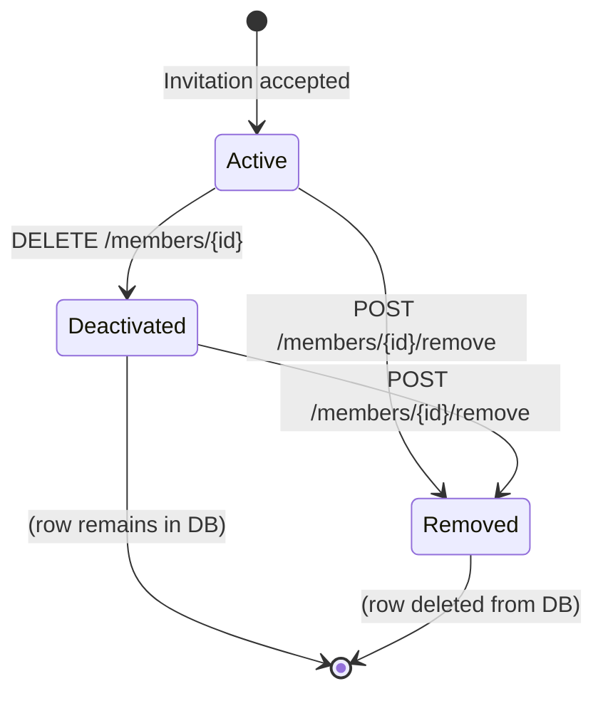

# Members

## Overview

The Members module handles organization membership lifecycle. Each user belongs to an organization through an `organization_members` record. Members can be:

- **Updated** — change role or other admin-managed fields
- **Deactivated** — soft-delete (set `is_active = false`)
- **Removed** — delete the membership row entirely (user account is preserved)

### Organization member model

```go
type OrganizationMember struct {
    ID       uuid.UUID // Membership record ID
    OrgID    uuid.UUID // Organization ID
    UserID   uuid.UUID // User account ID
    RoleID   uuid.UUID // Assigned role ID
    IsActive bool      // Soft-delete flag
    JoinedAt time.Time // When the member joined
}
```

### Membership lifecycle



---

## Endpoints

### Update a member

Updates admin-managed fields for an organization member. Requires `users.manage` permission.

```http
PATCH /api/v1/org/members/{member_id}
Content-Type: application/json
Authorization: Bearer <jwt>

{
    "role_id": "550e8400-e29b-41d4-a716-446655440002"
}
```

**Response** `200 OK`:
```json
{
    "message": "member updated successfully",
    "member_id": "550e8400-e29b-41d4-a716-446655440050"
}
```

**Currently supported fields:**
| Field | Type | Description |
|---|---|---|
| `role_id` | string (UUID) | New role to assign to the member |

**Behavior:**
1. The member must exist and belong to the caller's organization
2. The target role must also exist in the same organization
3. Self-updating is **forbidden** — you cannot change your own membership through this endpoint
4. Only provided fields are updated (partial update)

**Errors:**
| Status | Condition |
|---|---|
| `400` | Invalid member_id or role_id format |
| `400` | Role not found in this organization |
| `401` | Missing or invalid JWT |
| `403` | Insufficient permissions |
| `403` | Cannot update your own membership |
| `404` | Member not found or not in this organization |
| `500` | Internal server error |

---

### Deactivate a member

Soft-deletes a member by setting `is_active = false`. Requires `users.manage` permission.

```http
DELETE /api/v1/org/members/{member_id}
Authorization: Bearer <jwt>
```

**Response** `200 OK`:
```json
{
    "message": "member deactivated successfully",
    "member_id": "550e8400-e29b-41d4-a716-446655440050"
}
```

**Behavior:**
1. The member must exist and belong to the caller's organization
2. Self-deactivation is **forbidden**
3. Already-deactivated members cannot be deactivated again
4. The membership row remains in the database with `is_active = false`
5. The user account is **not** affected

**Errors:**
| Status | Condition |
|---|---|
| `400` | Invalid member_id |
| `400` | Member is already deactivated |
| `401` | Missing or invalid JWT |
| `403` | Insufficient permissions |
| `403` | Cannot deactivate your own membership |
| `404` | Member not found or not in this organization |
| `500` | Internal server error |

---

### Remove a member from the organization

Permanently removes a member from the organization by deleting the membership row. The user's account is **not** deleted. Requires `users.manage` permission.

```http
POST /api/v1/org/members/{member_id}/remove
Authorization: Bearer <jwt>
```

**Response** `200 OK`:
```json
{
    "message": "member removed from organization successfully",
    "member_id": "550e8400-e29b-41d4-a716-446655440050"
}
```

**Behavior:**
1. The member must exist and belong to the caller's organization
2. Self-removal is **forbidden**
3. The membership row is **deleted** from the `organization_members` table
4. The user account in the `users` table is **untouched** — the user can be invited again later
5. This is a hard delete of the membership, not a soft-delete

**Errors:**
| Status | Condition |
|---|---|
| `400` | Invalid member_id |
| `401` | Missing or invalid JWT |
| `403` | Insufficient permissions |
| `403` | Cannot remove yourself |
| `404` | Member not found or not in this organization |
| `500` | Internal server error |

---

## Comparison of member operations

| Operation | Method | Path | DB Impact | User Account |
|---|---|---|---|---|
| **Update** | `PATCH` | `/members/{id}` | Updates `role_id` | Unaffected |
| **Deactivate** | `DELETE` | `/members/{id}` | Sets `is_active = false` | Unaffected |
| **Remove** | `POST` | `/members/{id}/remove` | Deletes membership row | Unaffected |

## Notes

- All member endpoints require `users.manage` permission (except invitation which uses `users.invite`)
- The `member_id` path parameter is the UUID of the `organization_members` record, not the user ID
- Self-targeting (operating on your own membership) is prevented for all destructive operations
- To re-activate a deactivated member, use the `PATCH` endpoint — though no `is_active` field is currently exposed; this is a planned enhancement