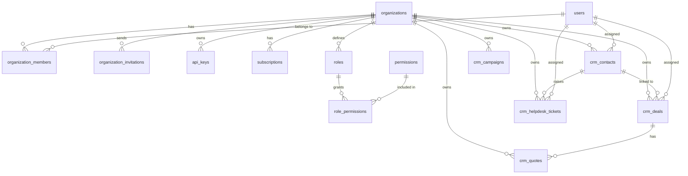

# Database Schema

## Overview

The database is PostgreSQL 16. Tables are created via idempotent migrations in `internal/database/database.go`. The schema uses UUID primary keys and `TIMESTAMPTZ` for timestamps.

## Entity-Relationship Diagram



## Table definitions

### `organizations`

```sql
CREATE TABLE organizations (
    id              UUID PRIMARY KEY DEFAULT gen_random_uuid(),
    domain_slug     VARCHAR(100) UNIQUE NOT NULL,
    custom_domain   VARCHAR(255) UNIQUE,
    company_name    VARCHAR(255) NOT NULL,
    default_currency VARCHAR(3) DEFAULT 'USD',
    timezone        VARCHAR(50) DEFAULT 'UTC',
    status          VARCHAR(50) DEFAULT 'active',
    created_at      TIMESTAMPTZ DEFAULT NOW(),
    updated_at      TIMESTAMPTZ DEFAULT NOW()
);
```

| Column | Type | Notes |
|---|---|---|
| `id` | UUID | Primary key, auto-generated |
| `domain_slug` | VARCHAR(100) | Unique, used in URL routing |
| `custom_domain` | VARCHAR(255) | Nullable, unique |
| `company_name` | VARCHAR(255) | Display name |
| `default_currency` | VARCHAR(3) | ISO 4217 currency code |
| `timezone` | VARCHAR(50) | IANA timezone name |
| `status` | VARCHAR(50) | Enum: `active`, `suspended`, `pending_verification` |
| `created_at` | TIMESTAMPTZ | Auto-set |
| `updated_at` | TIMESTAMPTZ | Auto-set |

### `users`

```sql
CREATE TABLE users (
    id              UUID PRIMARY KEY DEFAULT gen_random_uuid(),
    email           VARCHAR(255) UNIQUE NOT NULL,
    password_hash   VARCHAR(255) NOT NULL,
    full_name       VARCHAR(150) NOT NULL,
    phone_number    VARCHAR(50),
    mfa_enabled     BOOLEAN DEFAULT FALSE,
    mfa_secret      VARCHAR(255),
    created_at      TIMESTAMPTZ DEFAULT NOW()
);
```

| Column | Type | Notes |
|---|---|---|
| `id` | UUID | Primary key, auto-generated |
| `email` | VARCHAR(255) | Unique, used for login |
| `password_hash` | VARCHAR(255) | bcrypt hash |
| `full_name` | VARCHAR(150) | Display name |
| `phone_number` | VARCHAR(50) | Nullable |
| `mfa_enabled` | BOOLEAN | Whether MFA is configured |
| `mfa_secret` | VARCHAR(255) | TOTP secret (sensitive, not exposed in JSON) |
| `created_at` | TIMESTAMPTZ | Auto-set |

### `roles`

```sql
CREATE TABLE roles (
    id              UUID PRIMARY KEY DEFAULT gen_random_uuid(),
    org_id          UUID NOT NULL REFERENCES organizations(id) ON DELETE CASCADE,
    name            VARCHAR(100) NOT NULL,
    description     VARCHAR(255),
    is_system_default BOOLEAN DEFAULT FALSE,
    UNIQUE(org_id, name)
);
```

| Column | Type | Notes |
|---|---|---|
| `id` | UUID | Primary key, auto-generated |
| `org_id` | UUID | FK → organizations |
| `name` | VARCHAR(100) | Unique per organization |
| `description` | VARCHAR(255) | Nullable |
| `is_system_default` | BOOLEAN | Reserved for system roles |

### `permissions`

```sql
CREATE TABLE permissions (
    id              UUID PRIMARY KEY DEFAULT gen_random_uuid(),
    permission_key  VARCHAR(100) UNIQUE NOT NULL,
    module          VARCHAR(50) NOT NULL,
    description     VARCHAR(255)
);
```

| Column | Type | Notes |
|---|---|---|
| `id` | UUID | Primary key, auto-generated |
| `permission_key` | VARCHAR(100) | Unique, e.g. `users.invite` |
| `module` | VARCHAR(50) | Module name for grouping |
| `description` | VARCHAR(255) | Human-readable description |

### `role_permissions`

```sql
CREATE TABLE role_permissions (
    role_id         UUID NOT NULL REFERENCES roles(id) ON DELETE CASCADE,
    permission_id   UUID NOT NULL REFERENCES permissions(id) ON DELETE CASCADE,
    PRIMARY KEY (role_id, permission_id)
);
```

| Column | Type | Notes |
|---|---|---|
| `role_id` | UUID | FK → roles |
| `permission_id` | UUID | FK → permissions |

### `organization_members`

```sql
CREATE TABLE organization_members (
    id              UUID PRIMARY KEY DEFAULT gen_random_uuid(),
    org_id          UUID NOT NULL REFERENCES organizations(id) ON DELETE CASCADE,
    user_id         UUID NOT NULL REFERENCES users(id) ON DELETE CASCADE,
    role_id         UUID NOT NULL REFERENCES roles(id),
    is_active       BOOLEAN DEFAULT TRUE,
    joined_at       TIMESTAMPTZ DEFAULT NOW(),
    UNIQUE(org_id, user_id)
);
```

| Column | Type | Notes |
|---|---|---|
| `id` | UUID | Primary key, auto-generated |
| `org_id` | UUID | FK → organizations |
| `user_id` | UUID | FK → users |
| `role_id` | UUID | FK → roles |
| `is_active` | BOOLEAN | Used for soft-delete |
| `joined_at` | TIMESTAMPTZ | Auto-set |

### `organization_invitations`

```sql
CREATE TABLE organization_invitations (
    id              UUID PRIMARY KEY DEFAULT gen_random_uuid(),
    org_id          UUID NOT NULL REFERENCES organizations(id) ON DELETE CASCADE,
    email           VARCHAR(255) NOT NULL,
    role_id         UUID NOT NULL REFERENCES roles(id),
    token           VARCHAR(255) UNIQUE NOT NULL,
    expires_at      TIMESTAMPTZ NOT NULL,
    accepted_at     TIMESTAMPTZ,
    created_by      UUID REFERENCES users(id)
);
```

| Column | Type | Notes |
|---|---|---|
| `id` | UUID | Primary key, auto-generated |
| `org_id` | UUID | FK → organizations |
| `email` | VARCHAR(255) | Invitee email |
| `role_id` | UUID | FK → roles |
| `token` | VARCHAR(255) | Unique, used for accepting invitation |
| `expires_at` | TIMESTAMPTZ | 7 days from creation |
| `accepted_at` | TIMESTAMPTZ | Nullable, set when accepted |
| `created_by` | UUID | FK → users, nullable |

### `api_keys`

```sql
CREATE TABLE api_keys (
    id              UUID PRIMARY KEY DEFAULT gen_random_uuid(),
    org_id          UUID NOT NULL REFERENCES organizations(id) ON DELETE CASCADE,
    name            VARCHAR(100) NOT NULL,
    key_hash        VARCHAR(255) UNIQUE NOT NULL,
    scopes          TEXT[],
    last_used_at    TIMESTAMPTZ,
    expires_at      TIMESTAMPTZ,
    created_at      TIMESTAMPTZ DEFAULT NOW()
);
```

| Column | Type | Notes |
|---|---|---|
| `id` | UUID | Primary key, auto-generated |
| `org_id` | UUID | FK → organizations |
| `name` | VARCHAR(100) | Human-readable name |
| `key_hash` | VARCHAR(255) | bcrypt hash of the secret key |
| `scopes` | TEXT[] | Array of permission scopes |
| `last_used_at` | TIMESTAMPTZ | Nullable, tracks last usage |
| `expires_at` | TIMESTAMPTZ | Nullable, key expiration |
| `created_at` | TIMESTAMPTZ | Auto-set |

### `subscriptions`

```sql
CREATE TABLE subscriptions (
    id                UUID PRIMARY KEY DEFAULT gen_random_uuid(),
    org_id            UUID NOT NULL REFERENCES organizations(id) ON DELETE CASCADE,
    plan_code         VARCHAR(50) NOT NULL,
    status            VARCHAR(50) DEFAULT 'trialing',
    stripe_customer_id VARCHAR(255),
    stripe_sub_id      VARCHAR(255),
    current_period_end TIMESTAMPTZ,
    created_at        TIMESTAMPTZ DEFAULT NOW(),
    updated_at        TIMESTAMPTZ DEFAULT NOW()
);
```

| Column | Type | Notes |
|---|---|---|
| `id` | UUID | Primary key, auto-generated |
| `org_id` | UUID | FK → organizations |
| `plan_code` | VARCHAR(50) | Plan identifier |
| `status` | VARCHAR(50) | Enum: `active`, `past_due`, `canceled`, `trialing` |
| `stripe_customer_id` | VARCHAR(255) | Stripe customer reference |
| `stripe_sub_id` | VARCHAR(255) | Stripe subscription reference |
| `current_period_end` | TIMESTAMPTZ | Current billing period end |
| `created_at` | TIMESTAMPTZ | Auto-set |
| `updated_at` | TIMESTAMPTZ | Auto-set |

## CRM tables

### `crm_contacts`

```sql
CREATE TABLE crm_contacts (
    id           UUID PRIMARY KEY DEFAULT gen_random_uuid(),
    org_id       UUID NOT NULL REFERENCES organizations(id) ON DELETE CASCADE,
    first_name   VARCHAR(100) NOT NULL,
    last_name    VARCHAR(100),
    email        VARCHAR(255),
    phone        VARCHAR(50),
    company_name VARCHAR(255),
    assigned_to  UUID REFERENCES users(id),
    created_at   TIMESTAMPTZ DEFAULT NOW()
);
```

| Column | Type | Notes |
|---|---|---|
| `id` | UUID | Primary key, auto-generated |
| `org_id` | UUID | FK → organizations |
| `first_name` | VARCHAR(100) | Required |
| `last_name` | VARCHAR(100) | Nullable |
| `email` | VARCHAR(255) | Nullable |
| `phone` | VARCHAR(50) | Nullable |
| `company_name` | VARCHAR(255) | Nullable |
| `assigned_to` | UUID | FK → users, nullable |
| `created_at` | TIMESTAMPTZ | Auto-set |

### `crm_deals`

```sql
CREATE TABLE crm_deals (
    id                  UUID PRIMARY KEY DEFAULT gen_random_uuid(),
    org_id              UUID NOT NULL REFERENCES organizations(id) ON DELETE CASCADE,
    contact_id          UUID REFERENCES crm_contacts(id) ON DELETE CASCADE,
    title               VARCHAR(255) NOT NULL,
    amount              DECIMAL(12, 2) NOT NULL DEFAULT 0.00,
    stage               VARCHAR(50) NOT NULL,
    ai_win_probability  INT,
    assigned_to         UUID REFERENCES users(id),
    created_at          TIMESTAMPTZ DEFAULT NOW()
);
```

| Column | Type | Notes |
|---|---|---|
| `id` | UUID | Primary key, auto-generated |
| `org_id` | UUID | FK → organizations |
| `contact_id` | UUID | FK → crm_contacts, nullable |
| `title` | VARCHAR(255) | Required |
| `amount` | DECIMAL(12,2) | Default 0.00 |
| `stage` | VARCHAR(50) | Pipeline stage (e.g. `lead`, `qualified`, `proposal`) |
| `ai_win_probability` | INT | AI-predicted win likelihood 0–100, nullable |
| `assigned_to` | UUID | FK → users, nullable |
| `created_at` | TIMESTAMPTZ | Auto-set |

### `crm_quotes`

```sql
CREATE TABLE crm_quotes (
    id            UUID PRIMARY KEY DEFAULT gen_random_uuid(),
    org_id        UUID NOT NULL REFERENCES organizations(id) ON DELETE CASCADE,
    deal_id       UUID REFERENCES crm_deals(id) ON DELETE CASCADE,
    quote_number  VARCHAR(100) NOT NULL,
    total_amount  DECIMAL(12, 2) NOT NULL,
    ai_risk_score DECIMAL(5,2),
    created_at    TIMESTAMPTZ DEFAULT NOW()
);
```

| Column | Type | Notes |
|---|---|---|
| `id` | UUID | Primary key, auto-generated |
| `org_id` | UUID | FK → organizations |
| `deal_id` | UUID | FK → crm_deals, nullable |
| `quote_number` | VARCHAR(100) | Required, display identifier |
| `total_amount` | DECIMAL(12,2) | Required |
| `ai_risk_score` | DECIMAL(5,2) | AI risk score 0–100, nullable, set by risk analysis |
| `created_at` | TIMESTAMPTZ | Auto-set |

### `crm_helpdesk_tickets`

```sql
CREATE TABLE crm_helpdesk_tickets (
    id                    UUID PRIMARY KEY DEFAULT gen_random_uuid(),
    org_id                UUID NOT NULL REFERENCES organizations(id) ON DELETE CASCADE,
    contact_id            UUID REFERENCES crm_contacts(id),
    subject               VARCHAR(255) NOT NULL,
    description           TEXT NOT NULL,
    priority              VARCHAR(50) DEFAULT 'medium',
    status                VARCHAR(50) DEFAULT 'open',
    ai_sentiment_score    DECIMAL(3, 2),
    ai_suggested_response TEXT,
    assigned_to           UUID REFERENCES users(id),
    created_at            TIMESTAMPTZ DEFAULT NOW()
);
```

| Column | Type | Notes |
|---|---|---|
| `id` | UUID | Primary key, auto-generated |
| `org_id` | UUID | FK → organizations |
| `contact_id` | UUID | FK → crm_contacts, nullable |
| `subject` | VARCHAR(255) | Required |
| `description` | TEXT | Required |
| `priority` | VARCHAR(50) | Enum: `low`, `medium`, `high`, `urgent` |
| `status` | VARCHAR(50) | Default `open` |
| `ai_sentiment_score` | DECIMAL(3,2) | AI sentiment analysis score, nullable |
| `ai_suggested_response` | TEXT | AI-generated response draft, nullable |
| `assigned_to` | UUID | FK → users, nullable |
| `created_at` | TIMESTAMPTZ | Auto-set |

### `crm_campaigns`

```sql
CREATE TABLE crm_campaigns (
    id                        UUID PRIMARY KEY DEFAULT gen_random_uuid(),
    org_id                    UUID NOT NULL REFERENCES organizations(id) ON DELETE CASCADE,
    name                      VARCHAR(255) NOT NULL,
    channel                   VARCHAR(50) NOT NULL,
    ai_target_segment_criteria JSONB,
    budget                    DECIMAL(12, 2),
    created_at                TIMESTAMPTZ DEFAULT NOW()
);
```

| Column | Type | Notes |
|---|---|---|
| `id` | UUID | Primary key, auto-generated |
| `org_id` | UUID | FK → organizations |
| `name` | VARCHAR(255) | Required |
| `channel` | VARCHAR(50) | Marketing channel (e.g. `email`, `social`, `ads`) |
| `ai_target_segment_criteria` | JSONB | AI-generated targeting rules, nullable |
| `budget` | DECIMAL(12,2) | Campaign budget, nullable |
| `created_at` | TIMESTAMPTZ | Auto-set |

## Seed data

The following permissions are inserted on every migration (idempotent via `ON CONFLICT DO NOTHING`):

| Permission Key | Module | Description |
|---|---|---|
| `users.invite` | users | Invite team members to the organization |
| `users.manage` | users | Manage organization members (update role, deactivate, remove) |
| `rbac.manage` | rbac | Create and manage roles and permissions |
| `apikeys.manage` | apikeys | Generate and revoke API keys |
| `billing.manage` | billing | Manage subscriptions and billing |
| `crm.leads.write` | crm | Create and manage CRM leads |
| `crm.quotes.write` | crm | Manage and analyze CRM quotes |

## Key constraints

- `organizations.domain_slug` is **UNIQUE**
- `organizations.custom_domain` is **UNIQUE** (nullable)
- `users.email` is **UNIQUE**
- `roles` has a **UNIQUE** constraint on `(org_id, name)`
- `permissions.permission_key` is **UNIQUE**
- `organization_members` has a **UNIQUE** constraint on `(org_id, user_id)`
- `api_keys.key_hash` is **UNIQUE**
- `organization_invitations.token` is **UNIQUE**
- Foreign keys use `ON DELETE CASCADE` for clean teardown, except `organization_members.role_id` which prevents accidental role deletion while members are assigned