# Database Schema

## Overview

The database is PostgreSQL 16. Tables are created via idempotent migrations in `internal/database/database.go`. The schema uses UUID primary keys and `TIMESTAMPTZ` for timestamps.

## Entity-Relationship Diagram

```mermaid
erDiagram
    organizations ||--o{ organization_members : "has"
    organizations ||--o{ organization_invitations : "sends"
    organizations ||--o{ api_keys : "owns"
    organizations ||--o{ subscriptions : "has"
    organizations ||--o{ roles : "defines"
    users ||--o{ organization_members : "belongs to"
    roles ||--o{ role_permissions : "grants"
    permissions ||--o{ role_permissions : "included in"
    organizations ||--o{ crm_contacts : "owns"
    organizations ||--o{ crm_deals : "owns"
    organizations ||--o{ crm_quotes : "owns"
    organizations ||--o{ crm_helpdesk_tickets : "owns"
    organizations ||--o{ crm_campaigns : "owns"
    crm_contacts ||--o{ crm_deals : "linked to"
    crm_deals ||--o{ crm_quotes : "has"
    crm_contacts ||--o{ crm_helpdesk_tickets : "raises"
    users ||--o{ crm_contacts : "assigned"
    users ||--o{ crm_deals : "assigned"
    users ||--o{ crm_helpdesk_tickets : "assigned"
    organizations ||--o{ warehouses : "owns"
    organizations ||--o{ products : "owns"
    organizations ||--o{ fleet_vehicles : "owns"
    organizations ||--o{ fleet_drivers : "owns"
    organizations ||--o{ shipments : "owns"
    organizations ||--o{ fleet_telematics_logs : "owns"
    organizations ||--o{ purchase_orders : "owns"
    products ||--o{ bill_of_materials : "has"
    bill_of_materials ||--o{ bom_components : "contains"
    products ||--o{ bom_components : "used in"
    fleet_vehicles ||--o{ fleet_telematics_logs : "generates"
    fleet_vehicles ||--o{ shipments : "assigned to"
    fleet_drivers ||--o{ shipments : "assigned to"
    users ||--o{ fleet_drivers : "linked to"
```



## Table definitions

### Core tables (organizations, users, roles, permissions, members, invitations, API keys, subscriptions)

See [Architecture overview](overview.md) for core table details.

## Supply Chain & Fleet tables

### `warehouses`

```sql
CREATE TABLE warehouses (
    id      UUID PRIMARY KEY DEFAULT gen_random_uuid(),
    org_id  UUID NOT NULL REFERENCES organizations(id) ON DELETE CASCADE,
    name    VARCHAR(100) NOT NULL,
    address TEXT
);
```

| Column | Type | Notes |
|---|---|---|
| `id` | UUID | Primary key, auto-generated |
| `org_id` | UUID | FK → organizations |
| `name` | VARCHAR(100) | Required |
| `address` | TEXT | Nullable |

### `products`

```sql
CREATE TABLE products (
    id               UUID PRIMARY KEY DEFAULT gen_random_uuid(),
    org_id           UUID NOT NULL REFERENCES organizations(id) ON DELETE CASCADE,
    sku              VARCHAR(100) NOT NULL,
    name             VARCHAR(255) NOT NULL,
    unit_price       DECIMAL(10, 2) NOT NULL,
    cost_price       DECIMAL(10, 2) NOT NULL,
    ai_reorder_point INT DEFAULT 15,
    UNIQUE(org_id, sku)
);
```

| Column | Type | Notes |
|---|---|---|
| `id` | UUID | Primary key, auto-generated |
| `org_id` | UUID | FK → organizations |
| `sku` | VARCHAR(100) | Unique per organization, stock keeping unit |
| `name` | VARCHAR(255) | Product name |
| `unit_price` | DECIMAL(10,2) | Selling price |
| `cost_price` | DECIMAL(10,2) | Cost price |
| `ai_reorder_point` | INT | AI-generated reorder threshold, default 15 |

### `bill_of_materials`

```sql
CREATE TABLE bill_of_materials (
    id                UUID PRIMARY KEY DEFAULT gen_random_uuid(),
    org_id            UUID NOT NULL REFERENCES organizations(id) ON DELETE CASCADE,
    parent_product_id UUID NOT NULL REFERENCES products(id),
    bom_code          VARCHAR(50) NOT NULL
);
```

| Column | Type | Notes |
|---|---|---|
| `id` | UUID | Primary key, auto-generated |
| `org_id` | UUID | FK → organizations |
| `parent_product_id` | UUID | FK → products, the assembled product |
| `bom_code` | VARCHAR(50) | BOM identifier code |

### `bom_components`

```sql
CREATE TABLE bom_components (
    id                   UUID PRIMARY KEY DEFAULT gen_random_uuid(),
    bom_id               UUID NOT NULL REFERENCES bill_of_materials(id) ON DELETE CASCADE,
    component_product_id UUID NOT NULL REFERENCES products(id),
    quantity_required    DECIMAL(10, 4) NOT NULL
);
```

| Column | Type | Notes |
|---|---|---|
| `id` | UUID | Primary key, auto-generated |
| `bom_id` | UUID | FK → bill_of_materials |
| `component_product_id` | UUID | FK → products, the component |
| `quantity_required` | DECIMAL(10,4) | Quantity of component needed |

### `fleet_vehicles`

```sql
CREATE TABLE fleet_vehicles (
    id            UUID PRIMARY KEY DEFAULT gen_random_uuid(),
    org_id        UUID NOT NULL REFERENCES organizations(id) ON DELETE CASCADE,
    vin           VARCHAR(17) UNIQUE NOT NULL,
    license_plate VARCHAR(20) NOT NULL,
    make          VARCHAR(50) NOT NULL,
    model         VARCHAR(50) NOT NULL,
    status        vehicle_status DEFAULT 'active',
    created_at    TIMESTAMPTZ DEFAULT NOW()
);
```

| Column | Type | Notes |
|---|---|---|
| `id` | UUID | Primary key, auto-generated |
| `org_id` | UUID | FK → organizations |
| `vin` | VARCHAR(17) | Unique, 17-char vehicle identification number |
| `license_plate` | VARCHAR(20) | License plate number |
| `make` | VARCHAR(50) | Vehicle manufacturer |
| `model` | VARCHAR(50) | Vehicle model |
| `status` | vehicle_status | Enum: `active`, `maintenance`, `decommissioned` |
| `created_at` | TIMESTAMPTZ | Auto-set |

### `fleet_drivers`

```sql
CREATE TABLE fleet_drivers (
    id             UUID PRIMARY KEY DEFAULT gen_random_uuid(),
    org_id         UUID NOT NULL REFERENCES organizations(id) ON DELETE CASCADE,
    user_id        UUID UNIQUE REFERENCES users(id) ON DELETE CASCADE,
    license_number VARCHAR(100) NOT NULL,
    safety_rating  DECIMAL(3, 2) DEFAULT 5.00
);
```

| Column | Type | Notes |
|---|---|---|
| `id` | UUID | Primary key, auto-generated |
| `org_id` | UUID | FK → organizations |
| `user_id` | UUID | FK → users, unique (one driver per user) |
| `license_number` | VARCHAR(100) | Driver's license number |
| `safety_rating` | DECIMAL(3,2) | Safety rating, default 5.00 |

### `shipments`

```sql
CREATE TABLE shipments (
    id                  UUID PRIMARY KEY DEFAULT gen_random_uuid(),
    org_id              UUID NOT NULL REFERENCES organizations(id) ON DELETE CASCADE,
    tracking_number     VARCHAR(100) UNIQUE NOT NULL,
    origin_address      TEXT NOT NULL,
    destination_address TEXT NOT NULL,
    status              shipment_status DEFAULT 'pending',
    assigned_vehicle_id UUID REFERENCES fleet_vehicles(id),
    assigned_driver_id  UUID REFERENCES fleet_drivers(id),
    created_at          TIMESTAMPTZ DEFAULT NOW()
);
```

| Column | Type | Notes |
|---|---|---|
| `id` | UUID | Primary key, auto-generated |
| `org_id` | UUID | FK → organizations |
| `tracking_number` | VARCHAR(100) | Unique |
| `origin_address` | TEXT | Shipment origin |
| `destination_address` | TEXT | Shipment destination |
| `status` | shipment_status | Enum: `pending`, `in_transit`, `delivered`, `cancelled` |
| `assigned_vehicle_id` | UUID | FK → fleet_vehicles, nullable |
| `assigned_driver_id` | UUID | FK → fleet_drivers, nullable |
| `created_at` | TIMESTAMPTZ | Auto-set |

### `fleet_telematics_logs`

```sql
CREATE TABLE fleet_telematics_logs (
    id             BIGSERIAL PRIMARY KEY,
    org_id         UUID NOT NULL REFERENCES organizations(id) ON DELETE CASCADE,
    vehicle_id     UUID NOT NULL REFERENCES fleet_vehicles(id) ON DELETE CASCADE,
    latitude       DECIMAL(10, 8) NOT NULL,
    longitude      DECIMAL(11, 8) NOT NULL,
    speed_kmh      DECIMAL(5, 2) NOT NULL,
    fuel_level_pct DECIMAL(5, 2),
    recorded_at    TIMESTAMPTZ DEFAULT NOW()
);
```

| Column | Type | Notes |
|---|---|---|
| `id` | BIGSERIAL | Auto-incrementing, suitable for high-volume ingestion |
| `org_id` | UUID | FK → organizations |
| `vehicle_id` | UUID | FK → fleet_vehicles, cascade delete |
| `latitude` | DECIMAL(10,8) | GPS latitude |
| `longitude` | DECIMAL(11,8) | GPS longitude |
| `speed_kmh` | DECIMAL(5,2) | Speed in km/h |
| `fuel_level_pct` | DECIMAL(5,2) | Fuel level percentage, nullable |
| `recorded_at` | TIMESTAMPTZ | Time of recording, default NOW() |

### `purchase_orders`

```sql
CREATE TABLE purchase_orders (
    id                     UUID PRIMARY KEY DEFAULT gen_random_uuid(),
    org_id                 UUID NOT NULL REFERENCES organizations(id) ON DELETE CASCADE,
    po_number              VARCHAR(100) NOT NULL,
    supplier_name          VARCHAR(255) NOT NULL,
    total_cost             DECIMAL(12, 2) NOT NULL,
    ai_supplier_risk_rating VARCHAR(50) DEFAULT 'Low Risk',
    status                 VARCHAR(50) DEFAULT 'draft',
    created_at             TIMESTAMPTZ DEFAULT NOW()
);
```

| Column | Type | Notes |
|---|---|---|
| `id` | UUID | Primary key, auto-generated |
| `org_id` | UUID | FK → organizations |
| `po_number` | VARCHAR(100) | PO identifier |
| `supplier_name` | VARCHAR(255) | Supplier name |
| `total_cost` | DECIMAL(12,2) | Total order cost |
| `ai_supplier_risk_rating` | VARCHAR(50) | AI risk rating, default 'Low Risk' |
| `status` | VARCHAR(50) | Default 'draft' |
| `created_at` | TIMESTAMPTZ | Auto-set |

## Custom Enums

### `vehicle_status`

```sql
CREATE TYPE vehicle_status AS ENUM ('active', 'maintenance', 'decommissioned');
```

### `shipment_status`

```sql
CREATE TYPE shipment_status AS ENUM ('pending', 'in_transit', 'delivered', 'cancelled');
```

## Seed data

The following permissions are inserted on every migration (idempotent via `ON CONFLICT DO NOTHING`):

| Permission Key | Module | Description |
|---|---|---|
| `users.invite` | users | Invite team members to the organization |
| `users.manage` | users | Manage organization members (update role, deactivate, remove) |
| `rbac.manage` | rbac | Create and manage roles and permissions |
| `apikeys.manage` | apikeys | Generate and revoke API keys |
| `billing.manage` | billing | Manage subscriptions and billing |
| `crm.leads.write` | crm | Create and manage CRM leads |
| `crm.quotes.write` | crm | Manage and analyze CRM quotes |
| `crm.tickets.write` | crm | Create and manage CRM support tickets |
| `accounting.ledger.write` | accounting | Post general ledger journal entries |
| `accounting.invoices.write` | accounting | Upload and process invoices |
| `expenses.submit` | accounting | Submit expense reports |
| `fleet.telematics.ingest` | fleet | Ingest vehicle telemetry data via API key |
| `fleet.routes.manage` | fleet | Generate and manage optimized fleet routes |
| `inventory.read` | inventory | Read inventory reorder predictions and stock levels |

## Key constraints

- `organizations.domain_slug` is **UNIQUE**
- `organizations.custom_domain` is **UNIQUE** (nullable)
- `users.email` is **UNIQUE**
- `roles` has a **UNIQUE** constraint on `(org_id, name)`
- `permissions.permission_key` is **UNIQUE**
- `organization_members` has a **UNIQUE** constraint on `(org_id, user_id)`
- `api_keys.key_hash` is **UNIQUE**
- `organization_invitations.token` is **UNIQUE**
- `products` has a **UNIQUE** constraint on `(org_id, sku)`
- `fleet_vehicles.vin` is **UNIQUE**
- `fleet_drivers.user_id` is **UNIQUE**
- `shipments.tracking_number` is **UNIQUE**
- Foreign keys use `ON DELETE CASCADE` for clean teardown, except `organization_members.role_id` which prevents accidental role deletion while members are assigned
