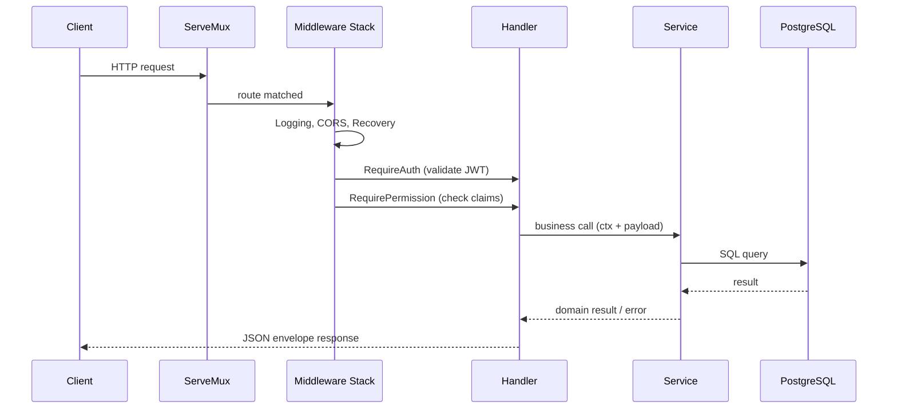

# Architecture Overview

## Layered architecture

Strata follows a **three-layer architecture** with a clear separation of concerns:

```
┌─────────────────────────────────────────────────────────┐
│                   HTTP Layer (handlers)                  │
│   • Parse request bodies and query params                │
│   • Extract auth claims from context                     │
│   • Call services                                        │
│   • Write JSON responses via utils.Envelope              │
├─────────────────────────────────────────────────────────┤
│              Business Layer (services)                   │
│   • Domain types and validation                          │
│   • Repository structs with raw SQL                      │
│   • Business rules (e.g., "can't deactivate yourself")   │
├─────────────────────────────────────────────────────────┤
│              Infrastructure (database)                   │
│   • pgx connection pool                                  │
│   • Schema migrations                                    │
└─────────────────────────────────────────────────────────┘
```

## Request flow



## Package responsibilities

### `internal/handlers` — HTTP layer

- `App` struct holds all injected dependencies (services, config, DB)
- Route registration happens in `routes()` using Go 1.22+ `net/http` patterns
- Handlers are thin: parse input → call service → write output
- Route-level middleware (`RequireAuth`, `RequirePermission`) is composed at registration time

### `internal/services` — Business layer

One file per domain, each containing:

1. **Domain types** — structs with JSON tags
2. **Repository** — unexported struct wrapping `*pgxpool.Pool`, raw SQL methods
3. **Service** — exported struct with business logic methods
4. **Domain errors** — `var` block of `errors.New(...)` sentinels

Example (from `services_users.go`):
```
User             → users table
OrganizationMember → organization_members table
userRepository   → SQL for users + memberships
UserService      → Create, GetByID, AddMember, UpdateMemberRole,
                   DeactivateMember, RemoveMember, GetMemberByID
```

### `internal/utils` — Shared helpers

Pure functions with no dependency on other project packages:

- **response.go** — `WriteJSON`, `WriteErr`, `Envelope`
- **middleware.go** — `RequireAuth`, `RequirePermission`, `LoggingMiddleware`, `CORSMiddleware`, `RecoveryMiddleware`, `GetClaims`
- **validator.go** — `IsEmail`, `IsDomainSlug`, `NotBlank`, `MinLen`

### `internal/config` & `internal/env`

Configuration is loaded from environment variables at startup. `env` provides safe getters (`GetString`, `GetInt`, `GetBool`) with fallback values. `config` aggregates them into a typed `Config` struct.

### `internal/database`

Owns the `pgxpool.Pool` and runs schema migrations on startup (idempotent `CREATE TABLE IF NOT EXISTS`).

## Dependency injection

All dependencies are constructed in `cmd/api/main.go` and injected into `App` via the `handlers.New()` constructor:

```
main.go
  ├── database.New(ctx, dsn)          → *database.DB
  ├── services.NewAuthService(...)    → *AuthService
  ├── services.NewUserService(pool)   → *UserService
  ├── services.NewOrgService(pool)    → *OrgService
  ├── services.NewRBACService(pool)   → *RBACService
  ├── services.NewBillingService(pool)→ *BillingService
  ├── services.NewMailer()            → *Mailer
  ├── services.NewCRMService(pool)    → *CRMService
  └── handlers.New(cfg, db, ...)      → *App
```

Services that need database access accept `*pgxpool.Pool` directly.

## Middleware stack

Global middleware wraps the entire mux (outermost first):

```go
var handler http.Handler = mux
handler = utils.CORSMiddleware(handler)    // outermost
handler = utils.LoggingMiddleware(handler)
handler = utils.RecoveryMiddleware(handler) // innermost
```

Route-level middleware wraps individual handlers:

```go
utils.RequireAuth(a.Auth)(                 // outermost
    utils.RequirePermission(services.PermUsersManage)(
        http.HandlerFunc(a.updateMemberHandler),
    ),
)
```

## Error handling strategy

- **Services** return typed errors (sentinels like `ErrMemberNotFound`) or plain errors
- **Handlers** translate errors to HTTP responses with appropriate status codes
- **Handlers** never leak internal error details; they return generic messages like `"could not update member"` with a 500
- **Domain errors** that map to client-facing status codes (400/404/409) are checked explicitly with `errors.Is`

## Design decisions

| Decision | Rationale |
|---|---|
| Repository pattern within services | No ORM; explicit SQL keeps queries transparent and performance predictable |
| JWT embeds permissions | Permission checks need no DB round-trip per request |
| Soft-delete for member deactivation | Preserves history, allows reactivation, keeps FK references valid |
| Hard-delete only for member removal | Removes the membership cleanly; user account stays intact |
| `Envelope` for all responses | Consistent API shape, easy to extend with pagination/meta |
| Raw SQL migrations at startup | Simple, idempotent, no external migration tool needed yet |