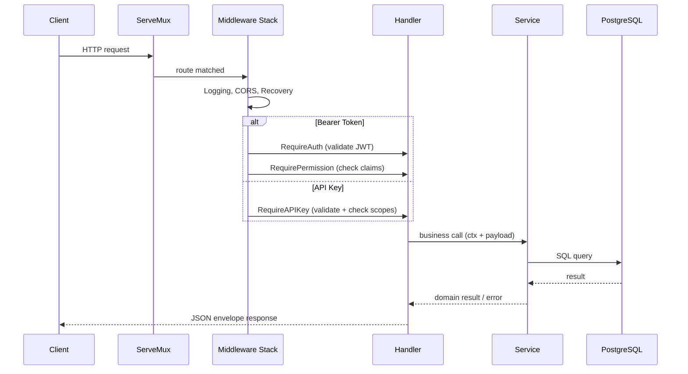

# Architecture Overview

## Layered architecture

Strata follows a **three-layer architecture** with a clear separation of concerns:

```
┌─────────────────────────────────────────────────────────────────┐
│                   HTTP Layer (handlers)                          │
│   • Parse request bodies and query params                        │
│   • Extract auth claims from context (JWT or API key)            │
│   • Call services                                                │
│   • Write JSON responses via utils.Envelope                      │
├─────────────────────────────────────────────────────────────────┤
│              Business Layer (services)                           │
│   • Domain types and validation                                  │
│   • Repository structs with raw SQL                              │
│   • Business rules (e.g., "can't deactivate yourself")           │
│   • AI simulation helpers (contract risk, sentiment, routing)    │
├─────────────────────────────────────────────────────────────────┤
│              Infrastructure (database)                           │
│   • pgx connection pool                                          │
│   • Schema migrations (idempotent CREATE TABLE IF NOT EXISTS)    │
└─────────────────────────────────────────────────────────────────┘
```

## Request flow



## Package responsibilities

### `internal/handlers` — HTTP layer

- `App` struct holds all injected dependencies (services, config, DB)
- Route registration happens in `routes()` using Go 1.22+ `net/http` patterns
- Handlers are thin: parse input → call service → write output
- Route-level middleware (`RequireAuth`, `RequirePermission`, `RequireAPIKey`) is composed at registration time

### `internal/services` — Business layer

One file per domain, each containing:

1. **Domain types** — structs with JSON tags
2. **Repository** — unexported struct wrapping `*pgxpool.Pool`, raw SQL methods
3. **Service** — exported struct with business logic methods
4. **Domain errors** — `var` block of `errors.New(...)` sentinels

Current services:
```
services_auth.go         → AuthService: JWT, bcrypt, refresh tokens
services_users.go        → UserService: users, organization memberships
services_orgs.go         → OrgService: organizations, invitations, API keys
services_rbac.go         → RBACService: roles, permissions
services_billing.go      → BillingService: subscriptions
services_crm.go          → CRMService: leads, deals, quotes, AI analysis
services_accounting.go   → AccountingService: journal entries, OCR, expenses, bank reconciliation, multi-currency exchange rates
services_supplychain.go  → SupplyChainService: fleet, telematics, inventory levels per warehouse, stock movements, routes
services_hr.go           → HRService: attendance, resume parsing, knowledge search, shift management, AI shift prediction, payroll tax withholding
services_platform.go     → PlatformService: text-to-SQL, workflows, audit anomalies, batch IoT ingestion
services_super_admin.go  → SuperAdminService: observability, SOC events, maintenance locks, CI health, user/org CRUD
services_registration.go → RegistrationService: atomic org+owner+role+membership registration
services_seed.go         → SeedService: idempotent super-admin seeding
services_mailer.go       → Mailer: transactional email (stub)
```

### `internal/utils` — Shared helpers

Pure functions with no dependency on other project packages:

- **response.go** — `WriteJSON`, `WriteErr`, `Envelope`
- **middleware.go** — `RequireAuth`, `RequireAuthCookie`, `RequirePermission`, `RequireAPIKey`, `LoggingMiddleware`, `CORSMiddleware`, `RecoveryMiddleware`, `MaxBodySizeMiddleware`, `PartitionedMaintenanceMiddleware`, `GetClaims`, `GetAPIKeyClaims`
- **ratelimit.go** — `RateLimitMiddleware`
- **csrf.go** — `ValidateCSRF` (double-submit cookie pattern)
- **totp.go** — `ValidateTOTP`
- **validator.go** — `IsEmail`, `IsDomainSlug`, `NotBlank`, `MinLen`

### `internal/config` & `internal/env`

Configuration is loaded from environment variables at startup. `env` provides safe getters (`GetString`, `GetInt`, `GetBool`) with fallback values. `config` aggregates them into a typed `Config` struct.

### `internal/database`

Owns the `pgxpool.Pool` with connection retry logic (5 attempts, 2s delay). Schema migrations are embedded as numbered `.up.sql` files in `internal/database/migrations/`, loaded via `embed.FS` at startup, and executed in lexicographic order. Migrations are **version-tracked** in the `schema_migrations` table — each migration is applied once and recorded, so only new migrations run on subsequent startups. Both `.up.sql` and `.down.sql` files exist for every migration (74 each).

## Dependency injection

All dependencies are constructed in `cmd/api/main.go` and injected into `App` via the `handlers.New()` constructor:

```
main.go
  ├── database.New(ctx, dsn)                       → *database.DB
  ├── services.NewAuthService(...)                 → *AuthService
  ├── services.NewUserService(pool)                → *UserService
  ├── services.NewOrgService(pool)                 → *OrgService
  ├── services.NewRBACService(pool)                → *RBACService
  ├── services.NewBillingService(pool)             → *BillingService
  ├── services.NewMailer()                         → *Mailer
  ├── ai.New(ai.ProviderKind(cfg.AIProvider))      → ai.Inferrer
  ├── services.NewCRMService(pool, aiSvc)          → *CRMService
  ├── services.NewAccountingService(pool, aiSvc)   → *AccountingService
  ├── services.NewSupplyChainService(pool, authSvc, aiSvc) → *SupplyChainService
  ├── services.NewHRService(pool, aiSvc)           → *HRService
  ├── services.NewPlatformService(pool, aiSvc)     → *PlatformService
  ├── services.NewSuperAdminService(pool, rdb)     → *SuperAdminService
  ├── services.NewRegistrationService(pool)        → *RegistrationService
  └── handlers.New(cfg, db, ...)                   → *App
```

Services that need database access accept `*pgxpool.Pool` directly. Services that need API key validation (supply chain) also accept `*AuthService` for bcrypt verification. The `SuperAdminService` additionally accepts an optional `*redis.Client` for multi-node sync and SSE fan-out.

The five domain services (CRM, Accounting, SupplyChain, HR, Platform) accept an `ai.Inferrer` — the seam behind which all AI inference lives. `main.go` selects the adapter via `AI_PROVIDER` (`stub` by default, `internal` for the placeholder provider).

> **Note:** The `BillingService` references `subscription_plans` via `plan_id` (UUID FK) instead of a `plan_code` string. The request payload still uses `plan_code` (e.g. `professional`), which is resolved to the plan's UUID at the service layer.

## Middleware stack

Global middleware wraps the entire mux (outermost first):

```go
var handler http.Handler = mux
handler = utils.MaxBodySizeMiddleware(1 << 20)(handler)          // outermost — 1 MiB body limit
handler = utils.CORSMiddleware(a.Config.AllowedOrigins)(handler) // configurable CORS origins
handler = utils.LoggingMiddleware(a.SuperAdmin)(handler)          // request logging + latency metrics
handler = utils.RecoveryMiddleware(a.SuperAdmin)(handler)         // panic recovery + stack capture
handler = utils.PartitionedMaintenanceMiddleware(a.SuperAdmin)(handler) // maintenance enforcement
```

Route-level middleware wraps individual handlers:

**Bearer token (JWT):**
```go
utils.RequireAuth(a.Auth)(                 // outermost
    utils.RequirePermission(services.PermUsersManage)(
        http.HandlerFunc(a.updateMemberHandler),
    ),
)
```

**Cookie + header (for HTML dashboards):**
```go
utils.RequireAuthCookie(a.Auth)(           // validates header OR cookie
    utils.RequirePermission(services.PermSuperAdmin)(
        http.HandlerFunc(a.superAdminDashboardHandler),
    ),
)
```

**API key auth:**
```go
utils.RequireAPIKey(a.SupplyChain, services.PermFleetTelematicsIngest)(
    http.HandlerFunc(a.ingestTelemetryHandler),
)
```

## Error handling strategy

- **Services** return typed errors (sentinels like `ErrMemberNotFound`) or plain errors
- **Handlers** translate errors to HTTP responses with appropriate status codes
- **Handlers** never leak internal error details; they return generic messages like `"could not update member"` with a 500
- **Domain errors** that map to client-facing status codes (400/404/409) are checked explicitly with `errors.Is`

## Design decisions

| Decision | Rationale |
|---|---|
| Repository pattern within services | No ORM; explicit SQL keeps queries transparent and performance predictable |
| JWT embeds permissions | Permission checks need no DB round-trip per request |
| API key auth for telemetry | Machine-to-machine endpoints use key-based auth for simplicity and performance |
| Soft-delete for member deactivation | Preserves history, allows reactivation, keeps FK references valid |
| Hard-delete only for member removal | Removes the membership cleanly; user account stays intact |
| `Envelope` for all responses | Consistent API shape, easy to extend with pagination/meta |
| Raw SQL migrations at startup | Simple, idempotent, no external migration tool needed yet. SQL files are embedded via `embed.FS` and numbered for ordering. |
| Inventory levels use generated column | `quantity_available = quantity_on_hand - quantity_reserved` ensures data integrity |
| Bank rec auto-matching | Matches by amount proximity (±1%) with manual override support via `reconciliation_matches` |
